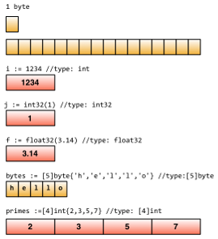
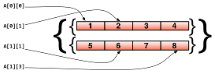
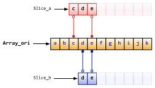
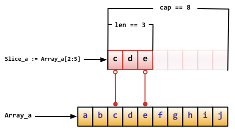
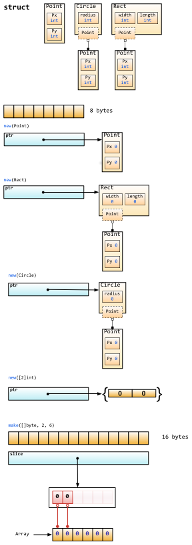

# 變數 & 資料結構

## 變數

我們使用 `var` 關鍵字來定義一個變數。變數的型態是放在變數的 **後面**。

```golang
// 宣告一個 "numberOfTimes" 的變數，他的型別是 "int"。
// 這個範例使用 int，但你可以使用其他任何型別
var numberOfTimes int

// 定義三個 "int" 型別的變數
var var1, var2, var3 int

// 宣告一個變數，型態是 int，值是 3
var numberOfTimes int = 3

/*
宣告三個變數，並且指派對應的值。var1 是 1、var2 是 2、var3 是 3
*/
var var1, var2, var3 int = 1, 2, 3
```

#### 宣告變數的簡短寫法

```golang
/*
宣告三個變數，但省略 var 關鍵字和型別，並且初始化他們的值。
*/
vname1, vname2, vname3 := v1, v2, v3
```

`:=` 只能夠在函式內使用，要定義全域變數，還是必須要使用 `var` 關鍵字，否則將會拋出 syntax error。

#### Blank variable

`_` 稱作 blank variable，它的其中一個用途是來忽略一個變數。

假設我們有一個函式叫做 `divide`，它接受兩個參數，並且會回傳第一個參數除以第二個參數的值和餘數。但我們只關心餘數，這時候我們就可以透過 `_` 把值給忽略。

```golang
	_ , remainder := divide(10, 3)
```

未使用的變數會導致編譯錯誤，嘗試編譯下面的程式碼，並且看看會發生什麼事情。

```golang
package main

func main() {
	var i int
}
```
## 常數

常數指的是在編譯時期才決定的變數，並且在執行時期不可被改變。在 Go 中，你可以使用數值、布林值或字串當作常數的型別。

#### 宣告常數

```golang
const constantName = value
// 當你需要時也可以指派常數的型別
const Pi float32 = 3.1415926
```

底下是更多常數的範例。

```golang
const Pi = 3.1415926
const i = 10000
const MaxThread = 10
const prefix = "astaxie_"
```
## Elementary types

#### 布林值(Boolean)

`bool` 關鍵字用來宣告布林值變數。布林值有兩種，`true` 和 `false`。`false` 是預設值。不像其他的語言，Go 不支援將布林值轉換為數值。

```golang
// 範例程式碼
var isActive bool  // 全域變數
var enabled, disabled = true, false  // 省略變數的型別
func test() {
	var available bool  // 區域變數
	valid := false      // 宣告變數的縮寫
	available = true    // 指派值給變數
}
```

#### 數值型型別

###### Integers

Integer 型別包含了有號和無號兩種，分別是 `int` 和 `uint`。他們兩個具有相同的長度，但確切的長度則取決於你的作業系統。在 32 位元的作業系統上就是 32 位元，而 64 位元的作業系統則是 64 位元。Go 還有一些其他長度的 Integer，像是：`rune`、`int8`、`int16`、`int32`、`int64`、`byte`、`uint8`、`uint16`、`uint32`、`uint64`。注意，`rune` 就是 `int32` 的別名，而 `byte` 則是 `uint8` 的別名。

Go 不支援不同型別之間互相進行運算，底下的程式碼會造成編譯錯誤。

```golang
var a int8

var b int32

c := a + b
```

即使 int32 的長度比 int8 長，而且都有著相同的 int 型別，你仍然不可以相加賦值。(***c 會被判斷為 `int`***)

###### Fractions
Float types have the `float32` and `float64` types and no type called `float`. The latter one is the default type if using brief statement.

###### 複數

Go 也支援複數。`complex128`(64 bits) 是預設的型別。如果你需要比較小的型別，可以使用 `complex64`(32 bits)。複數的格式是 `RE+IMi`，`RE` 是實數，而 `IM` 是虛數，`i` 則是虛數單位。底下是一個複數的範例。

```golang
	var c complex64 = 5+5i
	//output: (5+5i)
	fmt.Printf("Value is: %v", c)
```

#### 字串(String)

Go 使用 UTF-8 編碼，字串可以用 `""` 或是 ``` `` ``` 表示。

```golang
// sample code
var frenchHello string  // basic form to define string
var emptyString string = ""  // define a string with empty string
func test() {
	no, yes, maybe := "no", "yes", "maybe"  // brief statement
	japaneseHello := "Ohaiou"
	frenchHello = "Bonjour"  // basic form of assign values
}
```

字串物件本身不支援值的改變，嘗試編譯底下的程式碼會造成編譯錯誤。

```golang
var s string = "hello"
s[0] = 'c'
```

想要改變一個字串的值，你必須要使用舊的字串來建立一個新的字串。Go 不支援修改字串變數，但你總是可以建立新的。

```golang
s := "hello"
c := []byte(s)  // convert string to []byte type
c[0] = 'c'
s2 := string(c)  // convert back to string type
fmt.Printf("%s\n", s2)
```
	
`+` 運算子可以用來連接兩個字串。

```golang
s := "hello,"
m := " world"
a := s + m
fmt.Printf("%s\n", a)
```
或是底下的範例。

```golang
s := "hello"
s = "c" + s[1:] // returns substring from index 1 till the end.
fmt.Printf("%s\n", s)
```

\` (backtick) 用來表示多行的字串。

```golang
m := `hello
world`
```

\ `  (backtick) 不會跳脫任何字元。

#### 錯誤型別

Go 沒有 try cache 的機制，它只有一個 `error` 型別和一個 `errors` 的套件。Go 需要開發者自己處理錯誤，或是選擇忽略錯誤。一般在錯誤處理的格式會是 `if err != nil`。

```golang
err := errors.New("emit macho dwarf: elf header corrupted")
if err != nil {
	fmt.Print(err)
}
```

## 基本的資料結構

底下這張圖來自於 [Russ Cox's Blog](http://research.swtch.com/) 中的 [Go data structure](http://research.swtch.com/godata) 這篇文章。你可以看到，Go 使用記憶體區塊來儲存資料。



## 重點事項

#### 共同宣告

如果你想要宣告多個常數、變數或引用多個套件，你可以把它們放在一起宣告。

基本用法：

```golang
import "fmt"
import "os"

const i = 100
const pi = 3.1415
const prefix = "Go_"

var i int
var pi float32
var prefix string
```

群組在一起：

```golang

// 如果你引用了標準函式庫和第三方函式庫，標準函式庫會先被引用，接著才是第三方函式庫
import(
	"fmt"
	"os"

	"github.com/thewhitetulip/Tasks/views"
)

// 第一個常數的值會是零，除非你指派給它 iota
// 如果你沒有指派常數的值，只有最後一個常數有值，那所有的常數值都會和最後一個一樣

const(
	i = 100
	pi = 3.1415
	prefix = "Go_"
)

var(
	i int
	pi float32
	prefix string
)
```

#### iota enumerate

Go 有一個關鍵字叫做 `iota`，這個關鍵字是用來建立 `enum`，它從 0 開始，每次加一。

```golang
const(
	x = iota  // x == 0
	y = iota  // y == 1
	z = iota  // z == 2
	w  // 如果在常數後面沒有任何敘述，他會用最後一個敘述。所以 w = 3。換句話說，y 和 z 也可以不需要敘述。
)

const v = iota // 當 iota 遇到 const 關鍵字時，它就會被重新設定為 0，所以 v = 0

const ( 
	e, f, g = iota, iota, iota // iota 在同一行時，它們的值都會是 0
)
```

#### Some rules

Go 有一些預設的行為使它變得很簡潔。

- 任何以大寫開頭的變數都會被視為公有的。
- 同樣的規則適用於函式或常數，Go 沒有 `public` 或 `private` 的關鍵字。

## array, slice, map

#### 陣列

`array` 可以用以下的語法定義。

```golang
var arr [n]type
```
	
在 `[n]type` 中，`n` 是陣列的長度, `type` 是陣列中元素的型別。 跟其他的語言一樣，我們使用 `[]` 來取得或設定陣列中的元素值。

```golang
var arr [10]int  // an array of type [10]int
arr[0] = 42      // array is 0-based
arr[1] = 13      // assign value to element
fmt.Printf("The first element is %d\n", arr[0])  
// get element value, it returns 42
fmt.Printf("The last element is %d\n", arr[9]) 
// it returns default value of 10th element in this array,
// which is 0 in this case.
```

長度是陣列型別的其中一個參數，所以 `[3]int` 和 `[4]int` 是不同的型別。我們沒辦法改變陣列的長度。

當陣列當作參數傳到函式時，它是以傳值(pass by value)的方式，而不是傳送參考(pass by reference)。如果我們想要傳送參考，要用 `slice` 的方式。

你也可以用 `:=` 來宣告陣列。

```golang
a := [3]int{1, 2, 3} // 宣告一個陣列，當中有三個值

b := [10]int{1, 2, 3} 
// 宣告一個陣列，有十個元素，在這裡指派前三個元素，其餘的會是 0

c := [...]int{4, 5, 6} // 使用 ... 來取代指定特定的長度，Go 會自動幫你計算長度
```

你可能也會想要使用陣列當成陣列的元素，讓我們看看怎麼做。

```golang
// 定義一個二維陣列，當中有兩個元素，每一個元素中又包含四個元素。
doubleArray := [2][4]int{[4]int{1, 2, 3, 4}, [4]int{5, 6, 7, 8}}

// 更簡潔的寫法如下
easyArray := [2][4]int{{1, 2, 3, 4}, {5, 6, 7, 8}}
```
	
陣列的結構如下：



#### slice

使用陣列主要的一個缺點是我們需要預先知道他的長度。某些時候這是不可能的。這種情況下，我們必須要使用 *動態陣列*。在 Go 中，這叫做 `slice`。

`slice` 並不是真正的`動態陣列`。他是一個參考型別。`slice` 會指向一個底層是陣列的資料型態。他的宣告方式跟陣列很像，但是不需要指定長度。

```golang
// 就像宣告陣列一樣，只是不需要指定長度
var fslice []int
```

我們定義一個 `slice` 並且進行初始化

```golang
slice := []byte {'a', 'b', 'c', 'd'}
```

`slice` 可以重新指派既有的元素，`slice` 使用 `array[i:j]` 來將陣列轉換為一個 `slice`，`i` 是開始的 index，`j` 是結束的 index。

```golang
// 定義一個包含 10 個元素的 byte 陣列並初始化
var ar = [10]byte {'a', 'b', 'c', 'd', 'e', 'f', 'g', 'h', 'i', 'j'}

// 定義兩個 byte slice
var a, b []byte

// 'a' 指向陣列 ar 中的第三到第五個元素
a = ar[2:5]
// 現在 'a' 包含元素 ar[2],ar[3] 和 ar[4]

// 'b' 是另外一個包含 ar 元素的 slice
b = ar[3:5]
// 現在 'b' 包含元素 ar[3] 和 ar[4]
```

Notice the differences between `slice` and `array` when you define them. 

當你在宣告 `slice` 和 `陣列` 時要注意他們的差別。

我們使用 `[...]` 來讓 Go 自動計算長度，但使用 `[]` 來定義一個 slice。Slice 沒有長度，它指向一個陣列，陣列包含長度。

對應的資料結構如下：



Slice 包含一些好用的操作：

- 當你用 `ar[:n]` 時，等同於 `ar[0:n]` 的操作
- `slice` 中的第二個 index 如果你省略時，等同於整個 slice 的長度。`ar[n:]` 等同於 `ar[n:len(ar)]`。
- 如果你使用 `ar[:]` 的敘述，就代表整個 `slice`。原因就是前面兩點中所述。

更多範例：

```golang
// 宣告一個陣列
var array = [10]byte{'a', 'b', 'c', 'd', 'e', 'f', 'g', 'h', 'i', 'j'}
// 宣告兩個 slice
var aSlice, bSlice []byte

// 一些方便的操作
aSlice = array[:3] // 等同於 aSlice = array[0:3] aSlice 包含元素 a,b,c
aSlice = array[5:] // 等同於 aSlice = array[5:10] aSlice 包含元素 f,g,h,i,j
aSlice = array[:]  // 等同於 aSlice = array[0:10] aSlice 包含所有元素

// 從 slice 中建立 slice
aSlice = array[3:7]  // aSlice 包含元素 d,e,f,g，長度 4，容量 7
bSlice = aSlice[1:3] // bSlice 包含 aSlice[1], aSlice[2]，所以他有元素 e,f
bSlice = aSlice[:3]  // bSlice 包含 aSlice[0], aSlice[1], aSlice[2], 所以他有元素 d,e,f
bSlice = aSlice[0:5] // slice 可以根據容量來進行擴展，現在 bSlice 包含 d,e,f,g,h
bSlice = aSlice[:]   // bSlice 和 aSlice 現在有一樣的元素，包含 d,e,f,g
```

`slice` is a reference type, so any changes will affect other variables pointing to the same slice or array. 
For instance, in the case of `aSlice` and `bSlice` above, if you change the value of an element in `aSlice`, 
`bSlice` will be changed as well.

`slice` 是參考型別，所以任何的改動將會影響其他也指向相同 slice 或陣列的變數。

`slice` 包含三個部分。

- 一個指針指向 `slice` 從哪裡開始。
- `slice` 的長度。
- 容量，the length from start index to end index of `slice`.

```golang
Array_a := [10]byte{'a', 'b', 'c', 'd', 'e', 'f', 'g', 'h', 'i', 'j'}
Slice_a := Array_a[2:5]
```

底層的資料結構如下所示：



`slice` 還包含一些內建的函式：

- `len` 可以取得 `slice` 的長度。
- `cap` 可以取得 `slice` 最大的長度。
- `append` 附加一個或多個元素到 `slice`，回傳也是 `slice`。
- `copy` 複製一個 slice 到另外一個 slice，同時回傳他複製元素的數量。

注意： `append` 會改變 `slice` 指向的陣列，同時也會影響到其他指向該陣列的 `slice`。

同時，如果 slice 沒有足夠的長度時（`(cap-len) == 0`），`append` 會替這個 slice 回傳一個新的陣列。這種情況發生時，其他指向舊陣列的 slice 不會受到影響。

#### map
Map is a key value pair, like a dictionary in Python. Use the form `map[keyType]valueType` to define it.

Map 是一個 key、value 的 pair，就像在 Python 的 dictionary。在 Go 中使用 `map[keyType]valueType` 來定義。

`map` 中的 `set` 和 `get` 就跟 `slice` 很類似，然而，`slice` 的 index 只能是 int，但是 `map` 可以更有彈性，你可以使用 `int`、`string` 或其他任何你想要的 index。同樣的，你可以使用 `==` 或 `!=` 來進行比對。

```golang
// use string as the key type, int as the value type, and `make` initialize it.
var numbers map[string] int
// another way to define map
numbers := make(map[string]int)
numbers["one"] = 1  // assign value by key
numbers["ten"] = 10 
numbers["three"] = 3

fmt.Println("The third number is: ", numbers["three"]) // get values
// It prints: The third number is: 3
```

當你使用 map 有幾點要注意。

- `map` 是無順序的。每一次印出 `map` 的內容都是不一樣的。你不可能用 `index` 來取得對應值。你必須要用 `key`。
- `map` 沒有固定的長度。他跟 `slice` 一樣是個參考型別。
- `map` 也有 `len` 可用。 它會顯示這個 `map` 有多少 `key`。
- 要改變 `map` 的值是很容易的。你只需要 `numbers["one"]=11` 來改變 `key` 值 one 為 `11`。

你可以使用 `key:val` 的格式來初始化一個 `map` 的值。同時 `map` 也有內建的函式可以用來檢查一個 `key` 值存不存在。

使用 `delete` 來刪除一個在 `map` 中的元素。

```golang
// 初始化一個 map
rating := map[string]float32 {"C":5, "Go":4.5, "Python":4.5, "C++":2 }
// map 會回傳兩個值。第二個值如果某個 key 不存在，ok 會回傳 false，否則就是 true
csharpRating, ok := rating["C#"]
if ok {
		fmt.Println("C# is in the map and its rating is ", csharpRating)
} else {
		fmt.Println("We have no rating associated with C# in the map")
}

delete(rating, "C")  // 刪除 key "c" 的元素值
```

就像我上面說的，`map` 是一個參考型別。 如果兩個 `map` 都指向同一個資料，其中的改變會影響到另外一個 `map`。

```golang
m := make(map[string]string)
m["Hello"] = "Bonjour"
m1 := m
m1["Hello"] = "Salut"  // 現在 m["hello"] 也是 Salut
```
	
#### make, new

`make` 用來建立 `map`、`slice` 或 `channel`，而 `new` 是用來記憶體配置，返回零值。

`new(T)` 為型別 `T` 在記憶體中分配零值，並回傳該記憶體位置。也就是值 `*T`。在 Go 的定義中，他會回傳一個型別 `T` 的指標，對應的值都是零。

`new` 回傳一個指標。

內建的 `make(T, args)` 和 `new(T)` 的目的是不一樣的。`make` 用在 `slice`, `map`, 和 `channel`，並且回傳 `T` 以及其對應的初始化值。原因在於這三種型別的資料型態在使用之前並需要先初始化。例如，一個 `slice` 包含一個指標指向底層的 `array`、長度和容量。在這些資料初始化之前，`slice` 是 `nil`。`slice`、`map` 和 `channel` 都是一樣，`make` 初始化底層指向的資料，必且給予適當的值。

`make` 回傳非零值。

下圖描述了 `new` 和 `make` 的差別。



零值必不是空值。他是大多數變數的預設值。下圖是一些型別的預設零值。

```golang
int     0
int8    0
int32   0
int64   0
uint    0x0
rune    0 // rune 實際的型別是 int32
byte    0x0 // byte 實際的型別是 uint8
float32 0 // 長度是 4 byte
float64 0 // 長度是 8 byte
bool    false
string  ""
```

##### 連結

- [前一章節](02.1IntroductionGo.md)
- [下一章節](02.3CntrlStmtFunctions.md)
