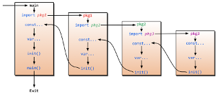

# 控制敘述與函式

## 控制敘述

### if

在 Go 中 `if` 的條件不需要括號：

```golang
if x > 10 {
	//when x is greater than 10 
	//program enters this block
	fmt.Println("x is greater than 10") 
} else {
	//when x is smaller than 10
	//program enters this block
	fmt.Println("x is less than or equal to 10")
} 
```

Go 允許在 `if` 中對變數初始化，並且使用初始化後的值來做判斷：

```golang
// 初始化 x, 接著判斷 x 是否大於 10 
if x := computedValue(); x > 10 {
	fmt.Println("x is greater than 10")
} else {
	fmt.Println("x is less than 10")
}

// 下面這行程式碼會無法編譯
fmt.Println(x)
```

多重判斷我們會用 else if

```golang
if integer == 3 {
	fmt.Println("The integer is equal to 3")
} else if integer < 3 {
	fmt.Println("The integer is less than 3")
} else {
	fmt.Println("The integer is greater than 3")
}
```

### goto

Go 有 `goto` 關鍵字，但使用它要很小心。`goto` 重新定義控制的流程到預先定義的 `label` 中：

```golang
func myFunc() {
	i := 0
Here:   // label ends with ":"
	fmt.Println(i)
	i++
	goto Here   // jump to label "Here"
}
```

label 名稱是有大小寫區分的。

### for

Go 沒有 while、do while 敘述。只有 `for`，但它是最強大的流程控制。它可以讀取資料並且循序讀取，就像 `while` 一樣。和 `if` 類似，`for` 不需要括號。

```golang
for expression1; expression2; expression3 {
	//...
}
```

```golang
package main
import "fmt"

func main(){
	sum := 0;
	for index:=0; index < 10 ; index++ {
		sum += index
	}
	fmt.Println("sum is equal to ", sum)
}
// Print: sum is equal to 45
```

我們可以省略一個或多個敘述。

```golang
sum := 1
for ; sum < 1000;  {
	sum += sum
}

for {
	//this is an infinite loop
}
```

使用 `for` 跟 `while` 類似的方法。


```golang
sum := 1
for sum < 1000 {
	sum += sum
}
```

#### break 和 continue

`break`： 離開一個迴圈。如果你使用巢狀迴圈，請使用 `break` 搭配 label。

`continue`： 離開現有的迴圈並開始下一次迴圈循環

```golang
for index := 10; index>0; index-- {
	if index == 5{
		break // or continue
	}
	fmt.Println(index)
}
// break prints 10、9、8、7、6
// continue prints 10、9、8、7、6、4、3、2、1
```

`for` 搭配 `range` 則可以從 `slice` 或 `map` 中讀取資料。

```golang
for k, v := range map {
	fmt.Println("map's key:",k)
	fmt.Println("map's val:",v)
}
```

因為 Go 支援多回傳值，同時在編譯階段會檢查未使用的宣告值，因此你可以用 `_` 來丟棄沒有使用的回傳值。

```golang
for _, v := range map{
	fmt.Println("map's val:", v)
}
```

#### switch

Switch 可以用來避免過長的 `if-else` 敘述。

```golang
switch sExpr {
case expr1:
	some instructions
case expr2:
	some other instructions
case expr3:
	some other instructions
default:
	other code
}
```

`sExpr`, `expr1`, `expr2` 和 `expr3` 的型態必須要一致。

Switch 的條件不需要是常數，同時它會從上到下去比對，直到遇到匹配的 case 敘述。如果在 `switch` 後沒有對應的敘述，那他會匹配 `true`。`default` 的狀況則會在沒有任何匹配的情況下執行。

```golang
i := 10
switch i {
case 1:
	fmt.Println("i is equal to 1")
case 2, 3, 4:
	fmt.Println("i is equal to 2, 3 or 4")
case 10:
	fmt.Println("i is equal to 10")
default:
	fmt.Println("All I know is that i is an integer")
}
```

Cases 可以有超過一個值，用逗號分開即可。預設 switch 只會匹配一個 case，但你也可以使用 `fallthrough` 來讓匹配的 case 以下的 cases 都執行。

```golang
integer := 6
switch integer {
case 4:
	fmt.Println("integer <= 4")
	fallthrough
case 5:
	fmt.Println("integer <= 5")
	fallthrough
case 6:
	fmt.Println("integer <= 6")
	fallthrough
case 7:
	fmt.Println("integer <= 7")
	fallthrough
case 8:
	fmt.Println("integer <= 8")
	fallthrough
default:
	fmt.Println("default case")
}
```

This program prints the following information. 這段程式碼會印出以下內容：

```
integer <= 6
integer <= 7
integer <= 8
default case
```

## 函式

`func`關鍵字用來宣告一個函式

```golang
func funcName(input1 type1, input2 type2) (output1 type1, output2 type2) {
	// function body
	// multi-value return
	return value1, value2
}
```

- 函式會包含零個、一個或超過一個參數。參數的型別放在參數名稱後面，用逗點分隔。
- 函式可以有多個回傳值。
- 上面的範例中有兩個回傳值，分別是 `output1` 和 `output2`。你可以省略他們的名稱，只使用型別。
- 如果函式只有一個回傳值，而你又省略他的名稱，那你可以不用加上括號。
- 如果函式沒有回傳值，你可以省略回傳參數。
- 如果函式有回傳值，你必須要用 `return` 關鍵字在函式中來回傳它們。

底下是一個計算最大值的程式碼：

```golang
package main
import "fmt"

// returns the greater value between a and b
func max(a, b int) int {
	if a > b {
		return a
	}
	return b
}

func main() {
	x := 3
	y := 4
	z := 5

	max_xy := max(x, y) // call function max(x, y)
	max_xz := max(x, z) // call function max(x, z)

	fmt.Printf("max(%d, %d) = %d\n", x, y, max_xy)
	fmt.Printf("max(%d, %d) = %d\n", x, z, max_xz)
	fmt.Printf("max(%d, %d) = %d\n", y, z, max(y,z)) // call function here
}
```

在函式宣告中，如果有兩個或兩個以上的參數都是相同的型別，我們可以把型別放在最後一個參數的後面。

`func max(a,b int, c,d string)`: 這代表我們有四個參數，`a、b` 是 `int` 型別，而 `c、d` 是 `string` 型別。

#### 多回傳值

```golang
package main
import "fmt"

// return results of A + B and A * B
func SumAndProduct(A, B int) (int, int) {
	return A+B, A*B
}

func main() {
	x := 3
	y := 4

	xPLUSy, xTIMESy := SumAndProduct(x, y)

	fmt.Printf("%d + %d = %d\n", x, y, xPLUSy)
	fmt.Printf("%d * %d = %d\n", x, y, xTIMESy)
}
```

`SumAndProduct` 會回傳兩個沒有命名的回傳值。Go 允許我們將回傳值命名。如果我們使用命名回傳值的特性，我們只需要使用 `return` 即可。

```golang
func SumAndProduct(A, B int) (add int, multiplied int) {
	add = A+B
	multiplied = A*B
	return
}
// Since return arguments are named, the function automatically 
// returns them
```

如果一個函式打算在現在的程式碼以外來使用，那最好明確的寫上回傳值，這樣會比較好閱讀。

#### 任意參數的函式

在許多情況下，我們無法確定一個函式會被傳入多少參數，此時，就可以使用任意參數這個特性。

`func myfunc(arg ...int) {}`

`arg …int` 告訴 Go 說這個函式有任一個參數。注意這些任意參數的型態都是 `int`。而在函式中，`arg` 會變成 `int` 的 `slice` 型別。

```golang
for _, n := range arg {
	fmt.Printf("And the number is: %d\n", n)
}
```

#### Pass by value and pointers

Argument are passed by value to the functions, the argument change inside the function doesn't affect the arguments used to call the function.

```golang
package main
import "fmt"

// simple function to add 1 to a
func add1(a int) int {
	a = a+1 // we change value of a 
	return a // return new value of a
}

func main() {
	x := 3

	fmt.Println("x = ", x)  // should print "x = 3"

	x1 := add1(x)  // call add1(x)

	fmt.Println("x+1 = ", x1) // should print "x+1 = 4"
	fmt.Println("x = ", x)    // should print "x = 3"
}
```

The original value of `x` doesn't change, because we passed x as a value, so the function add1 created a copy of x. Despite having the same names, the both variables are totally independant of each other.

In cases where we want to be able to modify the argument's value, we use pass by reference using pointers. 

In reality, a variable is nothing but a pointer to a location in memory. Each variable has a unique memory address. So, if we want to change the value of a variable, we must change its memory address. Therefore the function `add1` has to know the memory address of `x` in order to change its value. Here we pass `&x` to the function, and change the argument's type to the pointer type `*int`. Be aware that we pass a copy of the pointer, not copy of value.

```golang
package main
import "fmt"

// simple function to add 1 to a
func add1(a *int) int {
	*a = *a+1 // we changed value of a
	return *a // return new value of a
}

func main() {
	x := 3

	fmt.Println("x = ", x)  // should print "x = 3"

	x1 := add1(&x)  // call add1(&x) pass memory address of x

	fmt.Println("x+1 = ", x1) // should print "x+1 = 4"
	fmt.Println("x = ", x)    // should print "x = 4"
}
```

Advantages of pointers:

- Allows us to use more functions to operate on one variable.
- Low cost by passing memory addresses (8 bytes), copy is not an efficient way, both in terms of time and space, to pass variables.
- `string`, `slice` and `map` are reference types, so they use pointers when passing to functions by default. (Attention: If you need to change the length of `slice`, you have to pass pointers explicitly)

#### defer

Defer postpones the execution of a function till the calling function has finished executing. You can have many `defer` statements in one function; they will execute in reverse order when the program reaches its end. In the case where the program opens some resource files, these files would have to be closed before the function can return with errors. Let's see some examples.

```golang
func ReadWrite() bool {
	file.Open("file")
	// Do some work
	if failureX {
		file.Close()
		return false
	}

	if failureY {
		file.Close()
		return false
	}

	file.Close()
	return true
}
```

We saw some code being repeated several times. `defer` solves this problem very well. It doesn't only help you to write clean code but also makes your code more readable.

```golang
func ReadWrite() bool {
	file.Open("file")
	defer file.Close()
	if failureX {
		return false
	}
	if failureY {
		return false
	}
	return true
}
```

If there are more than one `defer`s, they will execute by reverse order. The following example will print `4 3 2 1 0`.

```golang
for i := 0; i < 5; i++ {
	defer fmt.Printf("%d ", i)
}
```

#### Functions as values and types

Functions are also variables in Go, we can use `type` to define them. Functions that have the same signature can be seen as the same type.

type typeName func(input1 inputType1 , input2 inputType2 [, ...]) (result1 resultType1 [, ...])

This makes Go a functional language as functions are a first class citizen.

```golang
package main
import "fmt"

type testInt func(int) bool // define a function type of variable

func isOdd(integer int) bool {
	if integer%2 == 0 {
		return false
	}
	return true
}

func isEven(integer int) bool {
	if integer%2 == 0 {
		return true
	}
	return false
}

// pass the function `f` as an argument to another function

func filter(slice []int, f testInt) []int {
	var result []int
	for _, value := range slice {
		if f(value) {
			result = append(result, value)
		}
	}
	return result
}

func main(){
	slice := []int {1, 2, 3, 4, 5, 7}
	fmt.Println("slice = ", slice)
	odd := filter(slice, isOdd)    // use function as values
	fmt.Println("Odd elements of slice are: ", odd)
	even := filter(slice, isEven) 
	fmt.Println("Even elements of slice are: ", even)
}
```

It's very useful when we use interfaces. As you can see `testInt` is a variable that has a function as type and the returned values and arguments of `filter` are the same as those of `testInt`. Therefore, we can have complex logic in our programs, while maintaining flexibility in our code.

#### Panic and Recover

Go doesn't have `try-catch` structure like Java does. Instead of throwing exceptions, Go uses `panic` and `recover` to deal with errors. However, you shouldn't use `panic` very much, although it's powerful.

`Panic` is a built-in function to break the normal flow of programs and get into panic status. When a function `F` calls `panic`, `F` will not continue executing but its `defer` functions will continue to execute. Then `F` goes back to the break point which caused the panic status. The program will not terminate until all of these functions return with panic to the first level of that `goroutine`. `panic` can be produced by calling `panic` in the program, and some errors also cause `panic` like array access out of bounds errors.

`Recover` is a built-in function to recover `goroutine`s from panic status. Calling `recover` in `defer` functions is useful because normal functions will not be executed when the program is in the panic status. It catches `panic` values if the program is in the panic status, and it gets `nil` if the program is not in panic status.

The following example shows how to use `panic`.

```golang
var user = os.Getenv("USER")

func init() {
	if user == "" {
		panic("no value for $USER")
	}
}
```

The following example shows how to check `panic`.

```golang
func throwsPanic(f func()) (b bool) {
	defer func() {
		if x := recover(); x != nil {
			b = true
		}
	}()
	f() // if f causes panic, it will recover
	return
}
```

#### main and init functions

Go has two retentions which are called `main` and `init`, where `init` can be used in all packages and `main` can only be used in the `main` package. These two functions are not able to have arguments or return values. Even though we can write many `init` functions in one package, I strongly recommend writing only one `init` function for each package.

Go programs will call `init()` and `main()` automatically, so you don't need to call them by yourself. For every package, the `init` function  is optional, but `package main` has one and only one `main` function.

Programs initialize and begin execution from the `main` package. If the `main` package imports other packages, they will be imported in the compile time. If one package is imported many times, it will be only compiled once. After importing packages, programs will initialize the constants and variables within the imported packages, then execute the `init` function if it exists, and so on. After all the other packages are initialized, programs will initialize constants and variables in the `main` package, then execute the `init` function inside the package if it exists. The following figure shows the process.



#### import

`import` is very often used in Go programs.

```golang
import(
	"fmt"
)
```

Methods of `fmt` are called as follows.

```golang
fmt.Println("hello world")
```
`fmt` is from Go standard library, it is located within $GOROOT/pkg. Go supports third-party packages in two ways.

1. Relative path
import "./model" // load package in the same directory, I don't recommend this way.
2. Absolute path
import "shorturl/model" // load package in path "$GOPATH/pkg/shorturl/model"

There are some special operators when we import packages, and beginners are always confused by these operators.

**Dot operator**

Sometimes we see people use following way to import packages.

```golang
import(
	. "fmt"
)
```
The dot operator means you can omit the package name when you call functions inside of that package. Now `fmt.Printf("Hello world")` becomes to `Printf("Hello world")`.

**Alias operation**

It changes the name of the package that we imported when we call functions that belong to that package.

```golang
import(
	f "fmt"
)
```

Now `fmt.Printf("Hello world")` becomes to `f.Printf("Hello world")`.

**`_` operator**

This is the operator that is difficult to understand without someone explaining it to you.

```golang
import (
	"database/sql"
	_ "github.com/ziutek/mymysql/godrv"
)
```

The `_` operator actually means we just want to import that package and execute its `init` function, and we are not sure if want to use the functions belonging to that package.

#####Links

-[Previous section](02.2VariablesDataStruct.md)
-[Next section](02.4Struct.md)
