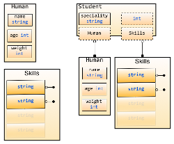

# Struct

## Struct 的基礎

Struct 在 Go 語言中可以用來定義客製化的型別。許多時候我們用內建的標準資料型態沒辦法處理真實世界的資訊，這時候就會顯得很沒有效率。舉個例子，在線上購物平台上，我們會有購物車的型別，用來放置購買商品和結帳使用。

```golang
type Product struct {
	name string
	itemID int
	cost float32
	isAvailable bool
	inventoryLeft int
}
```

在 Product 中你看到有很多屬性，有名稱、內部識別用的 ID、成本、庫存等等。

- `name` 是一個 `string` 用來儲存產品的名稱
- `itemID` 是一個 `int` 用來儲存產品的識別碼
- `cost` 是一個 `float32` 用來儲存產品的成本
- `isAvailable` 是一個 `bool` 用來識別產品是否有庫存
- `inventoryLeft` 是一個 `int` 用來儲存還有多少庫存

#### 初始化

```golang
// 定義 goBook 是一個 Product 型別
var goBook Product
// 指派 "Webapps in Go" 給欄位 'name'
goBook.name = "Webapps in Go"
// 指派 10025 給欄位 'itemID'
goBook.itemID = 10025
// 存取欄位 'name'
fmt.Printf("The product's name is %s\n", goBook.name)
```

以下還有三種方式可以定義一個 Struct：

- 按順序指派預設值

`goBook := Product{"Webapps in Go", 10025}`
	
- 使用這個格式： `field:value`來初始化 Struct(不需要按照順序)

`goBook := Product{name:"Webapps in Go", itemID:10025, cost:100}`

- 定義一個匿名的 Struct，並且初始化它

`p := struct{name string; age int}{"Amy",18}`
		
讓我們看一個複雜點的例子：

file: `code/Struct/Book/struct.go`
```golang
package main

import "fmt"

// Product will denote a physical object
// which we will sell online to be rich
type Product struct {
	name          string
	itemID        int
	cost          float32
	isAvailable   bool
	inventoryLeft int
}

func main() {
	var goBook Product

	// 初始化
	goBook.name, goBook.itemID, goBook.isAvailable, goBook.inventoryLeft = "Webapps in Go", 10025, true, 25

	// 透過 "field:value" 初始化
	pythonBook := Product{itemID: 10026, name: "Learn Python", inventoryLeft: 0, isAvailable: false}

	// 按照順序初始化
	rubyBook := Product{"Learn Ruby", 10043, 100, true, 12}

	if goBook.isAvailable {
		fmt.Printf("%d copies of %s are available\n", 
		goBook.inventoryLeft, goBook.name)
	}

	if pythonBook.isAvailable {
		fmt.Printf("%d copies of %s are available\n", 
		pythonBook.inventoryLeft, pythonBook.name)
	}

	if rubyBook.isAvailable {
		fmt.Printf("%d copies of %s are available\n", 
		rubyBook.inventoryLeft, rubyBook.name)
	}

}
```
	
#### 內嵌式的 struct

在先前的章節中，我們看到如何定義一個 Struct，並指定欄位名稱和型別。嵌入式欄位可以想成是在物件導向語言中的子類別和父類別的關係。

當內嵌欄位是一個 struct 的時候，所有的在該內嵌欄位的 struct 中的欄位可以讓被嵌入的 struct 存取。

讓我們來看一個例子：

file: `code/Struct/Human/human.go`
```golang
package main
import "fmt"

type Human struct {
	name string
	age int
	weight int
}

type Student struct {
	Human  // 內嵌欄位, 代表 Student struct 包含所有 Human struct 有的欄位
	specialty string
}

func main() {
	// 初始化一個學生 Struct
	mark := Student{Human{"Mark", 25, 120}, "Computer Science"}

	// 存取欄位
	fmt.Println("His name is ", mark.name)
	fmt.Println("His age is ", mark.age)
	fmt.Println("His weight is ", mark.weight)
	fmt.Println("His specialty is ", mark.specialty)
	// 修改 specialty
	mark.specialty = "AI"
	fmt.Println("Mark changed his specialty")
	fmt.Println("His specialty is ", mark.specialty)
	// 修改 age
	fmt.Println("Mark become old")
	mark.age = 46
	fmt.Println("His age is", mark.age)
	// 修改 weight
	fmt.Println("Mark is not an athlete anymore")
	mark.weight += 60
	fmt.Println("His weight is", mark.weight)
}
```
	


從上面的例子可以看到我們可以在 Student 中存取 `age` 和 `name`，就像我們在 Human 中一樣。這就是內嵌欄位的用途。我們甚至還可以在 Student 中存取 Human。

```golang
mark.Human = Human{"Marcus", 55, 220}
mark.Human.age -= 1
```
	
所有在 Go 中的型別都可以被用作為內嵌欄位

file: `code/Struct/Skills/skills.go`

```golang
package main
import "fmt"

type Skills []string

type Human struct {
	name string
	age int
	weight int
}

type Student struct {
	Human  // 用 struct 當作內嵌欄位
	Skills // 用 string slice 當作內嵌欄位
	int    // 內建的型別當作內嵌欄位
	specialty string
}

func main() {
	// 初始化 Student Jane
	jane := Student{Human:Human{"Jane", 35, 100}, specialty:"Biology"}
	// 存取欄位
	fmt.Println("Her name is ", jane.name)
	fmt.Println("Her age is ", jane.age)
	fmt.Println("Her weight is ", jane.weight)
	fmt.Println("Her specialty is ", jane.specialty)
	// 修改 skill 欄位的值
	jane.Skills = []string{"anatomy"}
	fmt.Println("Her skills are ", jane.Skills)
	fmt.Println("She acquired two new ones ")
	jane.Skills = append(jane.Skills, "physics", "golang")
	fmt.Println("Her skills now are ", jane.Skills)
	// 修改內嵌欄位
	jane.int = 3
	fmt.Println("Her preferred number is ", jane.int)
}
```

在上面的例子中，我們可以看到所有的型別都可以當作內嵌欄位，同時我們可以用函式來存取它們。

When we embed Human inside Employee, if Human and Employee have the phone field, then it isn't a problem. Because we access Employee's phone as Employee.Phone, but since Human is an embedded field inside Employee, we access Human's phone as Employee.Human.Phone

file: `code/Struct/Employee/employee.go`

```golang
	package main
	import "fmt"

	type Human struct {
    	name string
    	age int
    	phone string  // Human has phone field
	}

	type Employee struct {
    	Human  // embedded field Human
    	specialty string
    	phone string  // phone in employee
	}

	func main() {
    	Bob := Employee{Human{"Bob", 34, "777-444-XXXX"}, 
		    "Designer", "333-222"}
    	fmt.Println("Bob's work phone is:", Bob.phone)
    	// access phone field in Human
    	fmt.Println("Bob's personal phone is:", Bob.Human.phone)
	}
```

#####連結

-[前一章節](02.3CntrlStmtFunctions.md)
-[下一章節](02.5ObjectOriented.md)
